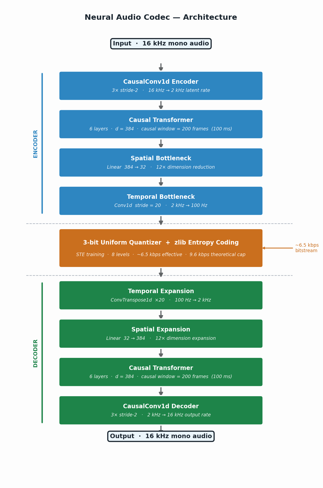

# Neural Audio Codec — Low-Bitrate Speech Compression

A transformer-based neural audio codec targeting real-time speech communication at sub-10 kbps with under 100 ms algorithmic latency.

Developed at TU Ilmenau under the supervision of Prof. Gerald Schuller.

---

## Replication — Quick Start

```bash
git clone https://gitlab.tu-ilmenau.de/muaw1874/audio_cod.git
cd audio_cod

python -m venv venv
source venv/bin/activate        # Windows: venv\Scripts\activate

pip install -r requirements.txt

# Downloads checkpoints (~480 MB) and LibriSpeech test-clean (~346 MB) if not present,
# then verifies the full setup end-to-end
python bootstrap.py
```

Once bootstrap completes with no failures, run inference:

```bash
# Default: uses first file from LibriSpeech test-clean
python scripts/infer_offline.py

# Or point to any audio file
python scripts/infer_offline.py --input /path/to/speech.wav
```

Each run writes to `inference_runs/<timestamp>/`:

```
source.wav           resampled input fed to the encoder
reconstructed.wav    decoded output
metrics.json         bitrate, PESQ-WB, STOI, SNR, run metadata
```

---

## Results

Evaluated on LibriSpeech test-clean (5 speakers, 5-second clips, 16 kHz mono).  
Phase C checkpoint — 3-bit uniform quantization + zlib entropy coding.

Evaluated on LibriSpeech test-clean (5 speakers, 5-second clips, 16 kHz mono).

| Codec | Bitrate | PESQ-WB | STOI |
|---|---|---|---|
| AAC | ~16 kbps | 1.641 | 0.855 |
| EnCodec 1.5 kbps (Meta) | 1.5 kbps | 1.611 | 0.829 |
| EnCodec 3.0 kbps (Meta) | 3.0 kbps | 2.148 | 0.880 |
| EnCodec 6.0 kbps (Meta) | 6.0 kbps | 2.842 | 0.922 |
| Ours — Phase C | 5.7 kbps | 1.202 | 0.733 |
| Ours — Phase G (default) | 5.9 kbps | 1.279 | 0.766 |

Phase G is the best-performing checkpoint across all phases. The quality gap versus EnCodec at matched bitrate reflects the fundamental difference in quantization scheme: 3-bit uniform scalar quantization versus residual vector quantization. The training progression from Phase C to Phase G yields a consistent improvement (+0.077 PESQ, +0.033 STOI) through combined spectral losses and fine-polish training.

To reproduce this table:

```bash
python scripts/03b_phaseC_eval.py
```

> **Note on PESQ:** the `pesq` package compiles a C extension at install time and requires platform build tools:
> - **Linux:** `sudo apt install python3-dev` (Debian/Ubuntu) or `sudo dnf install python3-devel` (RHEL/CentOS/Fedora), then `pip install pesq`
> - **macOS:** install Xcode Command Line Tools (`xcode-select --install`), then `pip install pesq`
> - **Windows:** install [Microsoft C++ Build Tools](https://visualstudio.microsoft.com/visual-cpp-build-tools/) (select the "Desktop development with C++" workload), then `pip install pesq`
>
> Without it, PESQ shows `n/a` and STOI is reported instead. `bootstrap.py` reports which metrics are available on your machine.

---

## Architecture



```
Waveform (16 kHz)
  → CausalConv encoder   [3× stride-2  →  2000 Hz latent rate]
  → Transformer          [6 layers, d=384, causal window=200 frames = 100 ms]
  → Linear(384 → 32)    [spatial bottleneck: 12× dimension reduction]
  → Conv1d stride=20    [temporal bottleneck: 2000 Hz → 100 Hz]
  ─── 3-bit quantise + zlib ───   (theoretical cap: 32×3×100 = 9.6 kbps)
  → ConvTranspose1d ×20
  → Linear(32 → 384)
  → Transformer decoder
  → CausalConv decoder
  → Waveform (16 kHz)
```

**Key properties**

| Property | Value |
|---|---|
| Algorithmic delay | 100 ms |
| Minimum streaming block | 100 ms |
| Quantization | 3-bit uniform (8 levels) + zlib |
| Sample rate | 16 kHz mono |
| Typical bitrate (Phase G) | ~6.5 kbps |

---

## Training Curriculum

Each phase loads from the previous phase's `best.pt`. Requires LibriSpeech `train-clean-100` (~6 GB) under `../datasets/LibriSpeech/train-clean-100/`.

```bash
python scripts/01_phaseA_train.py    # Phase A  — float32 temporal compression baseline
python scripts/02_phaseB_train.py    # Phase B  — 3-bit STE quantisation-aware training
python scripts/03a_phaseC_train.py   # Phase C  — noise augmentation (white/pink/babble)
python scripts/04a_phaseD_train.py   # Phase D  — uniform noise proxy (differentiable QAT)
python scripts/05a_phaseDvae_train.py # Phase D-VAE — variational bottleneck
python scripts/06a_phaseE_train.py   # Phase E  — log-magnitude STFT loss
python scripts/07a_phaseF_train.py   # Phase F  — triple combined spectral loss (40 epochs)
python scripts/08a_phaseG_train.py   # Phase G  — fine-polish pass (LR=2e-7, 20 epochs)
```

To evaluate a phase against the previous baseline:

```bash
python scripts/03b_phaseC_eval.py    # Phase C vs AAC vs EnCodec
python scripts/04b_phaseD_eval.py    # Phase D vs Phase C
python scripts/05b_phaseDvae_eval.py # Phase D-VAE vs Phase C
python scripts/06b_phaseE_eval.py    # Phase E vs Phase C
python scripts/07b_phaseF_eval.py    # Phase F vs Phase C
python scripts/08b_phaseG_eval.py    # Phase G vs Phase F vs Phase C
```

Each eval script writes audio samples, a metrics CSV, and a summary report to `comparisons/`.

---

## Dataset

Inference uses LibriSpeech `test-clean` by default. `bootstrap.py` downloads and extracts it automatically (~346 MB) if not already present. It is placed at:

```
../datasets/LibriSpeech/test-clean/
```

i.e. one directory above the project root, as a sibling of `audio_cod/`.

If you prefer to download it manually (or if the automatic download fails):

```bash
mkdir -p ../datasets/LibriSpeech
cd ../datasets/LibriSpeech
wget https://www.openslr.org/resources/12/test-clean.tar.gz
tar -xzf test-clean.tar.gz
```

To run inference on your own audio instead:

```bash
python scripts/infer_offline.py --input /path/to/speech.wav
```

---

## Project Structure

```
audio_cod/
├── bootstrap.py                    Entry point — run once after cloning
├── requirements.txt
├── config/
│   ├── paths.yaml                  Dataset and checkpoint path overrides
│   └── training.yaml
├── src/
│   ├── model.py                    Core architecture (encoder, bottleneck, decoder)
│   ├── losses.py                   Shared loss functions (STFT, spectral, noise utils)
│   ├── codec_utils.py              Shared inference utilities (load_model, encode_decode)
│   ├── train.py                    Base training loop and dataset classes
│   └── paths.py                    Dataset/checkpoint path resolution
├── scripts/
│   ├── infer_offline.py            Offline inference: encode → decode → metrics
│   ├── encode.py                   Standalone encoder  (audio → .nacodec)
│   ├── decode.py                   Standalone decoder  (.nacodec → audio)
│   ├── download_checkpoints.py     Download pre-trained weights from Google Drive
│   ├── 01_phaseA_train.py
│   ├── 02_phaseB_train.py
│   ├── 03a_phaseC_train.py  /  03b_phaseC_eval.py
│   ├── 04a_phaseD_train.py  /  04b_phaseD_eval.py
│   ├── 05a_phaseDvae_train.py  /  05b_phaseDvae_eval.py
│   ├── 06a_phaseE_train.py  /  06b_phaseE_eval.py
│   ├── 07a_phaseF_train.py  /  07b_phaseF_eval.py
│   └── 08a_phaseG_train.py  /  08b_phaseG_eval.py
├── checkpoints_active/             Downloaded by bootstrap.py — not tracked in git
│   ├── temporal_phaseC/best.pt
│   ├── temporal_phaseD/best.pt
│   ├── temporal_phaseD_vae/best.pt
│   ├── temporal_phaseE/best.pt
│   ├── temporal_phaseF/best.pt
│   └── temporal_phaseG/best.pt
└── inference_runs/                 Per-run artifacts from infer_offline.py — not tracked
```

---

## Dependencies

Core requirements are installed automatically by `bootstrap.py`. Key packages:

| Package | Purpose |
|---|---|
| `torch`, `torchaudio` | Model training and inference |
| `soundfile` | Audio I/O |
| `numpy`, `scipy` | Numerical computing |
| `av` | AAC encode/decode (Phase C evaluation) |
| `pyyaml` | Configuration |
| `tqdm` | Progress bars |
| `gdown` | Checkpoint download from Google Drive |
| `pystoi` | STOI metric |
| `pesq` | PESQ metric (requires `python3-dev` on Linux) |

---

## References

- Défossez et al., *High Fidelity Neural Audio Compression* (EnCodec, Meta 2022)
- Zeghidour et al., *SoundStream: An End-to-End Neural Audio Codec* (Google 2021)
- Panayotov et al., *LibriSpeech: An ASR Corpus Based on Public Domain Audio Books* (ICASSP 2015)
