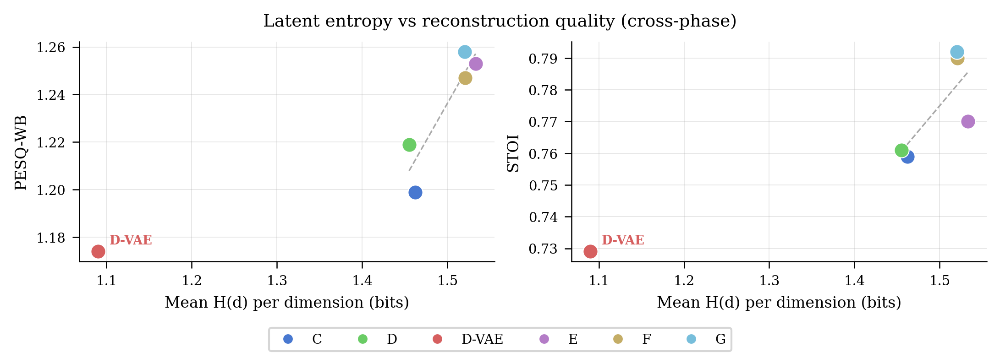
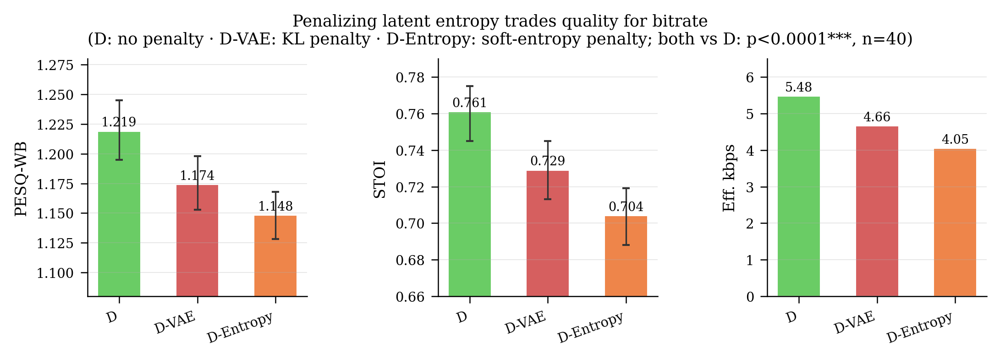
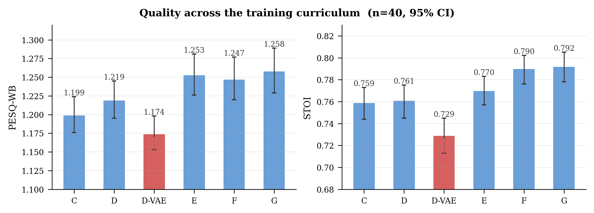
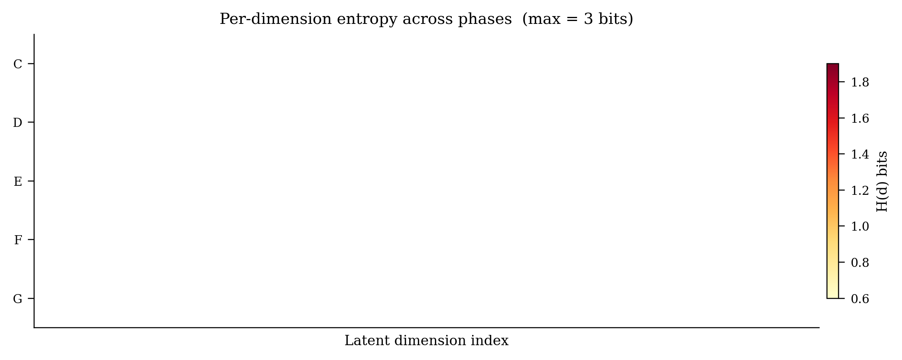
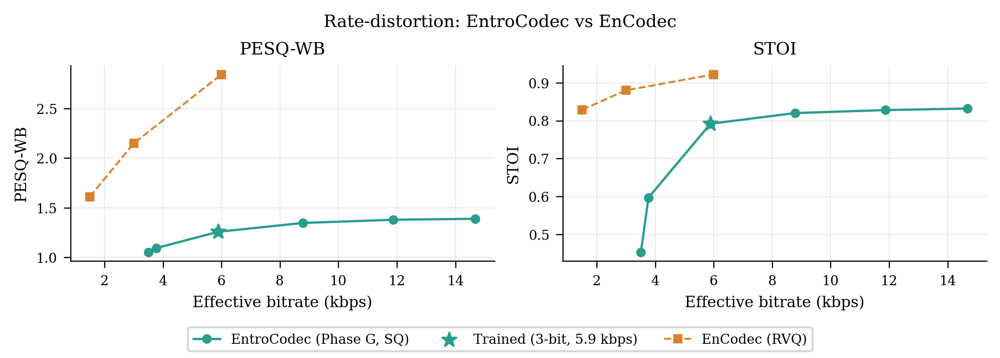
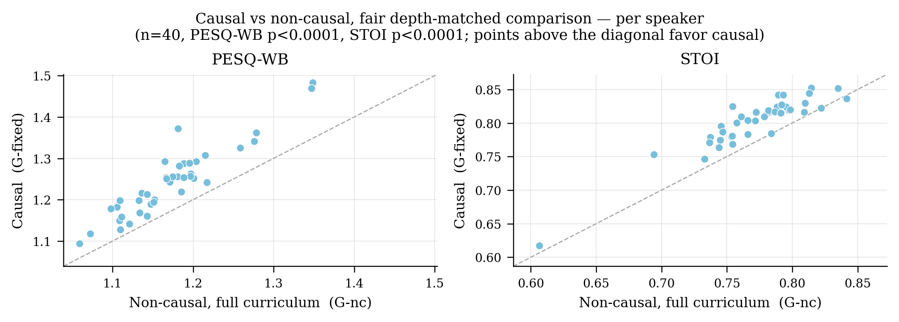
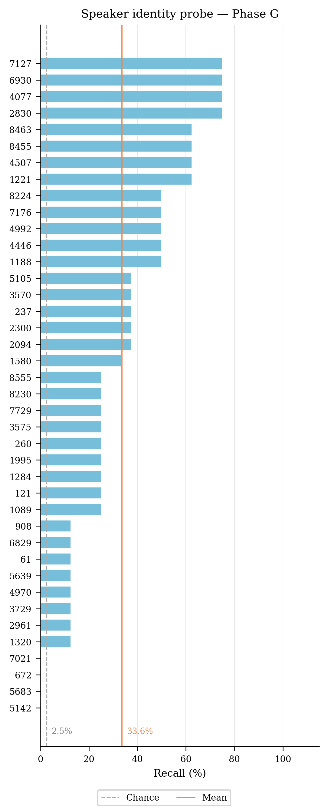
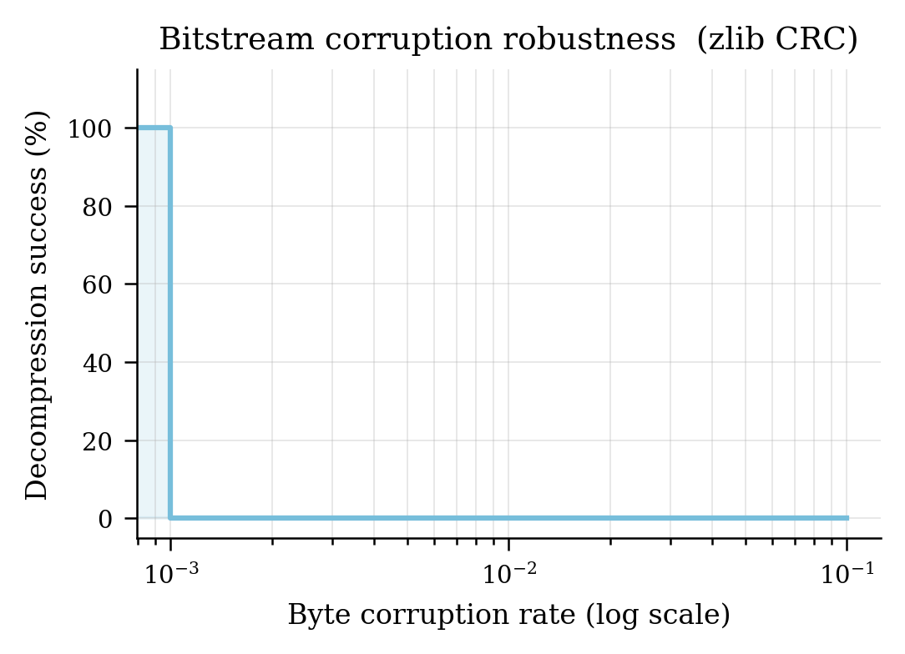
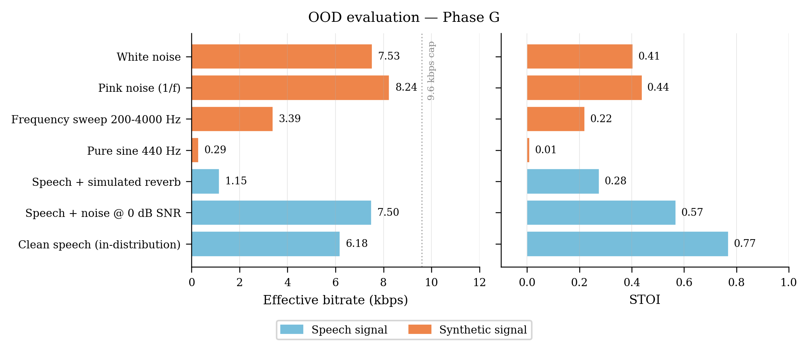
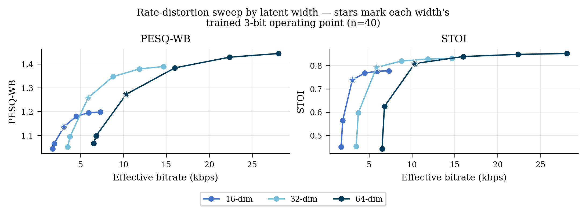

# Neural Audio Codec: What Determines the Rate–Distortion Ceiling of Scalar-Quantized Speech Codecs?

**EntroCodec** — a causal, streaming-capable neural audio codec built as the instrument for a controlled empirical study, not as an attempt to outperform state-of-the-art systems. The question: when a neural speech codec uses scalar quantization and a fixed, non-learned entropy coder, what sets the quality ceiling — quantizer resolution, or the information content the training objective places in the latent?

**Finding:** the ceiling is set by latent entropy — controlled by the training objective — not by quantization resolution. Adding more quantization bits past a point barely moves quality; deliberately regularizing entropy down (via a KL term) moves quality down with it; deliberately training for richer perceptual detail moves both up together, every time. This repository contains the codec, the eight-phase controlled training curriculum that produced this evidence, and every supporting experiment.

Developed at TU Ilmenau, Faculty of Electrical Engineering and Information Technology, under the supervision of Prof. Gerald Schuller. **Status:** project Exposé submitted; manuscript in preparation.



---

## Contents

- [The finding, in three pieces of evidence](#the-finding-in-three-pieces-of-evidence)
- [Results](#results)
- [Supporting experiments](#supporting-experiments)
- [Known limitations — disclosed](#known-limitations--disclosed)
- [Future work](#future-work)
- [Architecture](#architecture)
- [Quick start](#quick-start)
- [Separate encoder and decoder](#separate-encoder-and-decoder)
- [Training curriculum](#training-curriculum)
- [Dataset](#dataset)
- [Project structure](#project-structure)
- [Dependencies](#dependencies)
- [References](#references)

---

## The finding, in three pieces of evidence

### 1. Entropy and quality move together — in both directions

Every phase measures two things after training: perceptual quality (PESQ-WB, STOI) and the Shannon entropy of the quantized latent, per dimension. Across the five phases that are not D-VAE, both trend upward together as the training objective is made more perceptually sophisticated — C to G gains 0.020 PESQ-WB and 0.059 bits of entropy:

| Phase | Change | PESQ-WB | STOI | Bitrate | Mean latent entropy |
|---|---|---|---|---|---|
| C | Baseline (MSE + noise augmentation) | 1.223 | 0.778 | 5.83 kbps | 1.460 bits |
| D | Alternative quantization proxy | 1.265 | 0.782 | 5.87 kbps | 1.470 bits |
| **D-VAE** | **+ KL regularization** | **1.208** | **0.757** | **4.98 kbps** | **1.107 bits** |
| E | Log-magnitude spectral loss | 1.278 | 0.793 | 6.12 kbps | 1.523 bits |
| F | Combined triple spectral loss | 1.239 | 0.802 | 6.03 kbps | 1.517 bits |
| G | Fine-polish (best model) | 1.243 | 0.802 | 6.04 kbps | 1.519 bits |

Quality and bitrate are means over 40 LibriSpeech `test-clean` speakers with bootstrapped 95% confidence intervals (`comparisons/2026-08-13_confidence_intervals/report.txt`). Latent entropy is measured on the canonical 5-speaker set (`comparisons/2026-09-09_compression_analysis/report.txt`), which is the basis used for every entropy figure in this repository.

Phase D-VAE is the deliberate exception, and it's the piece that turns this from a correlation into evidence: a KL-divergence term directly penalizes the latent's entropy, with no change to the reconstruction objective. Entropy drops sharply (1.107 vs. ~1.5 bits elsewhere) — and quality drops with it, by 0.057 PESQ-WB and 0.025 STOI against Phase D, both p<0.0001 on a paired Wilcoxon test at n=40. This is the one experiment in the curriculum where entropy was pushed in the *opposite* direction from every other phase, on purpose, and quality followed it down anyway.

A second mechanism reproduces it with no VAE involved. Phase D-Entropy replaces the KL term with a soft penalty applied directly to the latent's own symbol distribution, and pushes entropy slightly further down than D-VAE manages:

| Phase | Mechanism | Mean latent entropy | PESQ-WB | STOI |
|---|---|---|---|---|
| D | none | 1.470 bits | 1.265 | 0.782 |
| D-VAE | β·KL | 1.107 bits | 1.208 | 0.757 |
| **D-Entropy** | **soft entropy penalty** | **1.022 bits** | **1.184** | **0.733** |

Both are significant against Phase D at p<0.0001 on both metrics. The two mechanisms share no machinery, and the one that suppresses entropy further also costs more quality.





The effect isn't concentrated in a few latent dimensions — it shows up broadly across nearly all 32:



Plots above predate the platform re-measurement; values differ from the tables only within the ranges shown, not in ordering or significance.

### 2. Adding quantization bits stops helping — the ceiling isn't resolution

Phase G's trained weights, swept from 1-bit to 6-bit quantization at inference time with no retraining:

| Bits | Levels | Theoretical kbps | Effective kbps | PESQ-WB | STOI |
|---|---|---|---|---|---|
| 1 | 2 | 3.2 | 3.50 | 1.033 | 0.558 |
| 2 | 4 | 6.4 | 3.75 | 1.111 | 0.697 |
| **3 (trained)** | 8 | 9.6 | 6.04 | 1.243 | 0.802 |
| 4 | 16 | 12.8 | 9.34 | 1.322 | 0.827 |
| 5 | 32 | 16.0 | 12.56 | 1.351 | 0.835 |
| 6 | 64 | 19.2 | 15.34 | 1.357 | 0.837 |

Going from 1-bit to 3-bit produces real gains. Past 3-bit, bitrate rises 2.5× (6.04 → 15.34 kbps) while STOI moves only 0.802 → 0.837 and PESQ-WB only 1.243 → 1.357. If the ceiling were a resolution problem, more bits would keep helping. It doesn't — it plateaus hard, meaning the latent had already run out of exploitable information well before the quantizer ran out of levels.



n=40, platform checkpoint (`comparisons/2026-08-13_rd_sweep_fixed/report.txt`). The plot predates this table, on the earlier configuration's sweep, within the same range. Reproduce against `checkpoints_active/temporal_phaseG_fixed/best.pt`.

### 3. Causality costs quality — a small but real and reproducible effect

An earlier non-causal ablation (bidirectional attention, fine-tuned for 30 epochs from Phase G, evaluated on 5 speakers) found no measurable difference from the causal model. Two corrections change that conclusion: correcting how the attention window was masked, and training the non-causal variant through the full A→G curriculum from scratch instead of fine-tuning it, so both models get the same training depth. Evaluated on 40 speakers:

| Model | Bitrate | PESQ-WB | STOI |
|---|---|---|---|
| G-fixed (causal) | 6.04 kbps | 1.243 | 0.802 |
| NC-fixed (non-causal, 30-epoch fine-tune) | 5.80 kbps | 1.222 | 0.791 |
| G-nc (non-causal, full A→G curriculum) | 5.55 kbps | 1.173 | 0.772 |

Causal beats non-causal under both protocols (paired Wilcoxon, n=40, p<0.0001 on PESQ-WB and STOI for G-fixed vs. NC-fixed and for G-fixed vs. G-nc). Training the non-causal model to the same depth as causal doesn't close the gap — it widens it, ruling out "non-causal just needed more training" as an explanation:



Almost every speaker falls above the diagonal — causal wins consistently, not just on average. The effect is real but small (ΔPESQ ≈ 0.02–0.07) next to the 1.58-point gap to EnCodec at the closest matched bitrate below: causality is a minor contributor to that gap, not the explanation for it — most of the gap comes from EnCodec's residual vector quantization and adversarial training, neither of which this project replicates.

---

## Results

Every row is a mean over the same 40 LibriSpeech `test-clean` speakers, 5-second clips, 16 kHz mono, with bootstrapped 95% confidence intervals. Reference codecs were measured locally with the same metric code as EntroCodec, so the comparison is matched on test set, clip length and metric implementation.

| Codec | Bitrate | PESQ-WB | STOI |
|---|---|---|---|
| EnCodec 1.5 kbps (Meta) | 1.50 kbps | 1.554 [1.499, 1.608] | 0.846 [0.837, 0.854] |
| EnCodec 3.0 kbps (Meta) | 3.00 kbps | 2.122 [2.045, 2.197] | 0.902 [0.894, 0.908] |
| EntroCodec — Phase C | 5.83 kbps | 1.223 [1.199, 1.248] | 0.778 [0.764, 0.790] |
| **EntroCodec — Phase G (default)** | **6.04 kbps** | **1.243 [1.218, 1.270]** | **0.802 [0.789, 0.813]** |
| EnCodec 6.0 kbps (Meta) | 6.00 kbps | 2.823 [2.734, 2.913] | 0.940 [0.933, 0.945] |
| AAC-LC | 15.83 kbps | 1.670 [1.593, 1.747] | 0.860 [0.855, 0.864] |

AAC is the classical anchor rather than a like-for-like competitor: AAC-LC cannot reach EntroCodec's operating point at all. Asked for 10 kbps it floors at 15.83 kbps on 16 kHz mono, which is 2.6× the bitrate Phase G runs at. EnCodec is the meaningful comparison, and the 6.0 kbps tier is the closest bitrate match to Phase G.

Measured with `scripts/eval_baselines.py`. AAC uses FFmpeg's native AAC-LC encoder through PyAV; EnCodec uses the released 24 kHz model, with the 16 kHz input resampled up and the output resampled back. The higher-quality `libfdk_aac` encoder, which supports HE-AAC and would reach lower bitrates, is not distributable in pip or conda builds and so was not available.

**On the gap to EnCodec:** at the closest matched bitrate, EnCodec at 6.0 kbps scores 2.823 against Phase G's 1.243, a gap of 1.58 PESQ-WB. EnCodec uses residual vector quantization and adversarial training, neither replicated here. Section 3 shows causality is only a minor contributor to that gap, worth ΔPESQ ≈ 0.02–0.07 from removing the real-time constraint, more than an order of magnitude smaller. The contribution is the controlled evidence for *why* scalar-quantization codecs hit their quality ceiling, not closing the gap to systems with structurally different architectures.

To reproduce: `python scripts/eval_confidence_intervals.py` for the EntroCodec rows, `python scripts/eval_baselines.py` for the reference rows.

> **Note on PESQ:** the `pesq` package compiles a C extension at install time. See [Dependencies](#dependencies) for platform-specific build tool requirements. Without it, PESQ shows `n/a` and STOI is reported instead.

---

## Supporting experiments

Three additional experiments characterize the latent and rule out alternative explanations.

**Speaker identity is not disentangled from content.** A linear probe on the frozen, mean-pooled Phase G latent recovers speaker identity at 33.6% accuracy against a 2.5% chance baseline (40 speakers), 13.5× above chance — expected, since reconstruction-only training has no mechanism to separate "what is said" from "who said it." Suppressing latent entropy also suppresses this leakage: the same probe recovers 33.0% on Phase D and 28.3% on Phase D-Entropy, so the entropy penalty compresses speaker identity along with everything else rather than trimming only content-irrelevant capacity.



**The bitstream fails completely, not gracefully, under corruption.** zlib's CRC-32 checksum means a single flipped bit causes total decode failure rather than degraded audio — 0% decode success at bit error rate ≥ 0.1%. A real deployment needs a channel-coding layer (e.g. Reed–Solomon) underneath this codec; this repository does not include one.



**Effective bitrate tracks signal complexity automatically, even out-of-distribution**, despite training exclusively on clean speech:



A pure tone compresses to 0.29 kbps; white/pink noise approaches the 9.6 kbps theoretical cap — bitrate is a direct, mechanical readout of latent entropy (Section 1), and that holds for signals the model never saw in training.

---

## Known limitations — disclosed

- **No positional encoding.** Temporal order comes from causal convolutions and the causal attention mask only.
- **Dropout was never active.** All training scripts passed `dropout=0.0`. Regularization came from noise augmentation and Phase D-VAE's KL term only.
- **Latent width (`bottleneck_dim=32`) — quality ordering and the D-VAE entropy-quality coupling both confirmed at 16 and 64 dims, measured on the earlier attention-window configuration.** No 16-dim or 64-dim checkpoint exists under the platform's window; training one is a separate task, not part of this report. Full A→G curricula at 16-dim and 64-dim order monotonically at their trained operating points (G-16: PESQ 1.136 < G-32: 1.258 < G-64: 1.273), though each width runs at a different bitrate there, so that ordering is bitrate-conditional rather than unconditional — see [Future work](#future-work) item 3. The D-VAE ablation (β·KL) at both widths (#41) confirms the coupling holds there too, same direction and significance (p<0.0001) as at 32-dim.

---

## Future work

The 20 CP research project is complete. The MS thesis (30 CP) extends it by testing whether the entropy-quality coupling generalises across additional axes.

### MS Thesis extensions

| # | Experiment | What it tests | Status |
|---|---|---|---|
| 1 | Soft entropy penalty training (D-Entropy) | Coupling holds under a second independent mechanism — not VAE-specific | **Closed.** D-Entropy vs D: ΔPESQ=−0.071, ΔSTOI=−0.057, p<0.0001*** (n=40, genuine — see issue #10). Larger effect than D-VAE. |
| 2 | Music evaluation — MUSDB18-HQ, SI-SDR | Modality independence — coupling holds beyond speech | **Closed.** D-VAE = highest compression (1.440×) + lowest SI-SDR (−7.35 dB) on 40 tracks. D-VAE vs D p<0.0001*** on both metrics. |
| 3 | Bottleneck width ablation (16 / 64 dims) | Coupling holds regardless of latent width | **Closed.** 16-dim confirmed below the 32-dim baseline unconditionally (across its full R-D curve). 64-dim beats the baseline only at its own higher trained bitrate — a bitrate-matched check (#31) shows the advantage doesn't survive controlling for bitrate. D-VAE ablation (#41) directly confirms the entropy-quality coupling itself holds at both 16-dim and 64-dim, same direction and significance (p<0.0001***) as at 32-dim. |



Each width's curve spans a different bitrate range (wider bottleneck → higher native bitrate), so the fair comparison is at the bitrates where curves overlap, not at each width's own endpoint. At ~6-7 kbps — where 32-dim and 64-dim overlap — 32-dim sits above 64-dim on both metrics; 64-dim only pulls ahead once it's spending far more bitrate than 32-dim ever does. 16-dim stays below both across its entire range.
| 4 | VQ comparison (replace SQ with RVQ, same encoder) | Coupling holds regardless of quantizer class — not SQ-specific | **Not started.** Requires a full RVQ curriculum from scratch. This is the strongest remaining open objection to the generality of the coupling claim. |

### Open housekeeping (resolve before numbers go in the paper)

| Item | What is needed |
|---|---|
| Phase A/B PESQ | **Resolved.** `pesq` now builds via a local conda env with its own Python headers (no Windows needed) — see issue #20. On the canonical protocol (5-speaker set, 5-second clips encoded as a single chunk, matching every other evaluation here) Phase A is 1.150 PESQ-WB / 0.626 STOI / 3.73 kbps and Phase B is 1.270 PESQ-WB / 0.716 STOI / 5.44 kbps. An earlier run of `eval_phaseAB.py` reported 1.181 / 0.529 and 1.280 / 0.557; it encoded in 1-second chunks rather than 5, which is the sole source of the discrepancy, and its numbers are superseded. |
| Phase G canonical entropy | **Resolved.** 1.520 bits (5-speaker canonical set) — used consistently for all headline numbers; the 1.5944-bit (4-speaker recompute) figure is superseded. |
| Bitrate standardisation | **Resolved.** 6.04 kbps is canonical for the platform checkpoint (n=40 — see #10), superseding the earlier 5.87/5.89/5.97 kbps figures from inconsistent speaker sets and the pre-platform attention window. |

---

## Architecture

[](architecture.png)

```
Waveform (16 kHz)
  → CausalConv encoder     [4 layers, k=7,7,7,3, s=2,2,2,1 → 2000 Hz latent rate]
  → Transformer            [6 layers, d=384, 8 heads — causal, 100 ms
                             (200-frame) attention window]
  → Linear(384 → 32)       [spatial bottleneck: 12× dimension reduction]
  → Conv1d stride=20       [temporal bottleneck: 2000 Hz → 100 Hz]
  ─── 3-bit quantise + zlib ───   (theoretical cap: 32×3×100 = 9.6 kbps; ~5.9 kbps effective)
  → ConvTranspose1d ×20
  → Linear(32 → 384)
  → Transformer decoder    [identical configuration to encoder]
  → CausalConv decoder
  → Waveform (16 kHz)
```

zlib is used deliberately for its lack of learned adaptivity: because it exploits only generic statistical redundancy, its achieved compression ratio functions as an unbiased probe of the latent's own Shannon entropy, and as a conservative lower bound relative to what a learned entropy model could achieve on the same representation.

**Key properties**

| Property | Value |
|---|---|
| Quantization | 3-bit uniform (8 levels) + zlib entropy coding |
| Sample rate | 16 kHz mono |
| Typical bitrate (Phase G) | ~6.0 kbps |
| Total parameters | 21.8M (encoder 10.87M, decoder 10.88M, projections and temporal stride 0.07M) |
| Streaming chunking | Set by inference chunk size (`encode.py` default: 1s), independent of the attention window |

---

## Quick start

```
git clone https://github.com/awais-de/audio_cod.git
cd audio_cod

python -m venv venv
source venv/bin/activate        # Windows: venv\Scripts\activate

pip install -r requirements.txt

# Downloads checkpoints (~480 MB) and LibriSpeech test-clean (~346 MB) if not present,
# then verifies the full setup end-to-end
python bootstrap.py
```

Once bootstrap completes with no failures, run inference:

```
# Default: uses first file from LibriSpeech test-clean
python scripts/infer_offline.py

# Or point to any audio file
python scripts/infer_offline.py --input /path/to/speech.wav
```

Each run writes to `inference_runs/<timestamp>/`:

```
source.wav           resampled input fed to the encoder
compressed.nacodec   compressed bitstream (decodable with scripts/decode.py)
reconstructed.wav    decoded output
metrics.json         bitrate, PESQ-WB, STOI, SNR, run metadata
```

Pass `--save 0` to discard `compressed.nacodec` after the run.

---

## Separate encoder and decoder

`infer_offline.py` saves the compressed bitstream as `compressed.nacodec` alongside the other outputs by default (pass `--save 0` to discard it). To encode and decode as two fully separate steps — simulating a transmit/receive pipeline — use the standalone scripts:

```
# Step 1 — encode: audio file → compressed binary
python scripts/encode.py input.wav compressed.nacodec

# Step 2 — decode: compressed binary → reconstructed audio (no original needed)
python scripts/decode.py compressed.nacodec reconstructed.wav
```

The `.nacodec` file is the actual compressed bitstream: a 28-byte header (magic bytes, sample rate, chunk dimensions) followed by the 3-bit scalar-quantised, zlib-compressed latent frames. Everything needed to reconstruct the audio is contained in this file; the original `input.wav` is not required at decode time.

Example output from the encoder:

```
checkpoint:  temporal_phaseG/best.pt  (phase=G, d_model=384, bottleneck=32)
input:       input.wav  (5.00s @ 16000 Hz, 80000 samples)
chunk   1/5  latent=(32, 100)  compressed=1181B
chunk   2/5  latent=(32, 100)  compressed=1173B
...
bitrate:     5.87 kbps
file_size:   3.7 KB  (157 KB uncompressed PCM, 42× reduction)
output:      compressed.nacodec
```

Example output from the decoder:

```
checkpoint:  temporal_phaseG/best.pt  (phase=G, d_model=384, bottleneck=32)
input:       compressed.nacodec  (5.00s @ 16000Hz, 5 chunks)
chunk   1/5  latent=(32, 100)  1181B  → 16000 samples
...
bitrate:     5.87 kbps
output:      reconstructed.wav
```

Both scripts accept `--checkpoint path/to/best.pt` to select a specific phase and `--device cpu` to run without a GPU.

---

## Training curriculum

This is the controlled experiment, not just a list of scripts. Phase C is the common parent: Phases D, D-VAE, D-Entropy, E and F each load Phase C's `best.pt` and change exactly one aspect of the training objective, holding architecture and data fixed. That makes them siblings rather than a chain, which is what lets Section 1 attribute the entropy-quality evidence to a specific cause instead of an aggregate correlation — every one of those phases differs from the same baseline by one variable. The chain runs only where it has to: A from the unconstrained base model, B from A, C from B, G from F, and the non-causal ablation from G.

```
phase1_base → A → B → C ─┬→ D          (uniform noise proxy)
                         ├→ D-VAE      (variational bottleneck)
                         ├→ D-Entropy  (soft entropy penalty)
                         ├→ E          (log-magnitude STFT loss)
                         └→ F → G      (triple spectral loss, then fine-polish)
```

Requires LibriSpeech `train-clean-100` (~6 GB) under `../datasets/LibriSpeech/train-clean-100/`.

```
python scripts/01_phaseA_train.py       # Phase A     — float32 baseline, no quantization
python scripts/02_phaseB_train.py       # Phase B     — 3-bit STE quantisation-aware training
python scripts/03a_phaseC_train.py      # Phase C     — noise augmentation (white/pink/babble)
python scripts/04a_phaseD_train.py      # Phase D     — uniform noise proxy (differentiable QAT)
python scripts/05a_phaseDvae_train.py   # Phase D-VAE — variational bottleneck (KL-regularized)
python scripts/06a_phaseEntropy_train.py # Phase D-Entropy — soft entropy penalty, no VAE
python scripts/06a_phaseE_train.py      # Phase E     — log-magnitude STFT loss
python scripts/07a_phaseF_train.py      # Phase F     — triple combined spectral loss (40 epochs)
python scripts/08a_phaseG_train.py      # Phase G     — fine-polish pass (LR=2e-7, 20 epochs)
```

All phases train with Adam at batch size 1 and 4 gradient-accumulation steps, 1000 samples per epoch, cosine-annealed learning rate, and `dropout=0.0`.

To evaluate a phase against its baseline:

```
python scripts/03b_phaseC_eval.py     # Phase C vs AAC vs EnCodec
python scripts/04b_phaseD_eval.py     # Phase D vs Phase C
python scripts/05b_phaseDvae_eval.py  # Phase D-VAE vs Phase C
python scripts/06b_phaseE_eval.py     # Phase E vs Phase C
python scripts/07b_phaseF_eval.py     # Phase F vs Phase C
python scripts/08b_phaseG_eval.py     # Phase G vs Phase F vs Phase C
python scripts/13_rd_sweep.py         # Rate-distortion sweep, 1-bit through 6-bit
```

Each eval script writes audio samples, a metrics CSV, and a summary report to `comparisons/`.

---

## Dataset

Inference uses LibriSpeech `test-clean` by default. `bootstrap.py` downloads and extracts it automatically (~346 MB) if not already present, placed at:

```
../datasets/LibriSpeech/test-clean/
```

i.e. one directory above the project root, as a sibling of `audio_cod/`.

If you prefer to download it manually (or if the automatic download fails):

```
mkdir -p ../datasets/LibriSpeech
cd ../datasets/LibriSpeech
wget https://www.openslr.org/resources/12/test-clean.tar.gz
tar -xzf test-clean.tar.gz
```

To run inference on your own audio instead:

```
python scripts/infer_offline.py --input /path/to/speech.wav
```

---

## Project structure

```
audio_cod/
├── bootstrap.py                    Entry point — run once after cloning
├── requirements.txt
├── architecture.png
├── plots/                          Figures referenced throughout this README
├── config/
│   ├── paths.yaml                  Dataset and checkpoint path overrides
│   └── training.yaml
├── src/
│   ├── model.py                    Core architecture (encoder, bottleneck, decoder)
│   ├── model_noncausal.py          Bidirectional variant used for the NC ablation
│   ├── losses.py                   Shared loss functions (STFT, spectral, noise utils)
│   ├── codec_utils.py              Shared inference utilities (load_model, encode_decode)
│   └── paths.py                    Dataset/checkpoint path resolution
├── scripts/
│   ├── infer_offline.py            Offline inference: encode → decode → metrics
│   ├── encode.py                   Standalone encoder  (audio → .nacodec)
│   ├── decode.py                   Standalone decoder  (.nacodec → audio)
│   ├── inspect_nacodec.py          Inspect a .nacodec file (header, per-chunk stats, bitrate)
│   ├── download_checkpoints.py     Download pre-trained weights from Google Drive
│   ├── 01_phaseA_train.py  …  08a_phaseG_train.py / 08b_phaseG_eval.py
│   └── 13_rd_sweep.py              Rate-distortion sweep across quantization bit-depths
├── checkpoints_active/             Downloaded by bootstrap.py — not tracked in git
│   ├── temporal_phaseC/best.pt
│   ├── temporal_phaseD/best.pt
│   ├── temporal_phaseD_vae/best.pt
│   ├── temporal_phaseE/best.pt
│   ├── temporal_phaseF/best.pt
│   └── temporal_phaseG/best.pt
└── inference_runs/                 Per-run artifacts from infer_offline.py — not tracked
```

---

## Dependencies

Core requirements are installed automatically by `bootstrap.py`. Key packages:

| Package | Purpose |
|---|---|
| `torch`, `torchaudio` | Model training and inference |
| `soundfile` | Audio I/O |
| `numpy`, `scipy` | Numerical computing |
| `av` | AAC encode/decode (Phase C evaluation) |
| `pyyaml` | Configuration |
| `tqdm` | Progress bars |
| `gdown` | Checkpoint download from Google Drive |
| `pystoi` | STOI metric |
| `pesq` | PESQ metric (requires build tools — see below) |

> **Note on PESQ:** the `pesq` package compiles a C extension at install time and requires platform build tools:
> - **Linux:** `sudo apt install python3-dev` (Debian/Ubuntu) or `sudo dnf install python3-devel` (RHEL/CentOS/Fedora), then `pip install pesq`
> - **macOS:** install Xcode Command Line Tools (`xcode-select --install`), then `pip install pesq`
> - **Windows:** install [Microsoft C++ Build Tools](https://visualstudio.microsoft.com/visual-cpp-build-tools/) (select the "Desktop development with C++" workload), then `pip install pesq`
>
> Without it, PESQ shows `n/a` and STOI is reported instead. `bootstrap.py` reports which metrics are available on your machine.

---

## References

- A. Brendel, N. Pia, K. Gupta, L. Behringer, G. Fuchs, and M. Multrus, "Neural Speech Coding for Real-Time Communications Using Constant Bitrate Scalar Quantization," *IEEE Journal of Selected Topics in Signal Processing*, 2024.
- A. Défossez, J. Copet, G. Synnaeve, and Y. Adi, "High Fidelity Neural Audio Compression" (EnCodec), *Transactions on Machine Learning Research*, 2023.
- V. Panayotov, G. Chen, D. Povey, and S. Khudanpur, "LibriSpeech: An ASR Corpus Based on Public Domain Audio Books," *ICASSP*, 2015.
- A. van den Oord, O. Vinyals, and K. Kavukcuoglu, "Neural Discrete Representation Learning" (VQ-VAE), *NeurIPS*, 2017.
- J. Xu, Z. Cheng, F. Zhang, Y. Liu, L. Song, and W. Zhang, "Benchmarking Neural Speech Compression from a Rate-Distortion Perspective," arXiv:2606.11631, 2026.
- N. Zeghidour, A. Luebs, A. Omran, J. Skoglund, and M. Tagliasacchi, "SoundStream: An End-to-End Neural Audio Codec," *IEEE/ACM Transactions on Audio, Speech, and Language Processing*, vol. 30, pp. 495–507, 2021.
